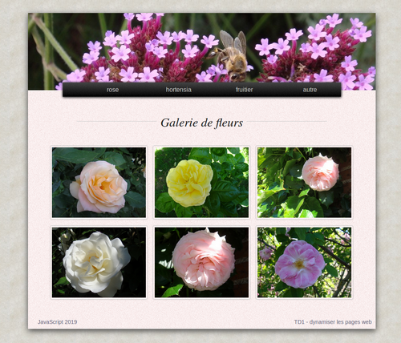

#  Prog web client riche - JavaScript 

### IUT Montpellier-Sète – Département Informatique

## TD1
#### _Thème : dynamiser une page web_

Cliquez sur le lien ci-dessous pour faire, dans un dossier public_html/JS/TD1, votre fork privé du TD1 (**attention, pas de fork à la main !**):

https://classroom.github.com/a/1pEh7RIt

la version [pdf](ressources/td1.pdf)

## INTRODUCTION

Vos TD et projets de S1 (Conception Doc) vous ont appris à créer des sites web statiques, où les pages ne varient pas. Leur seul aspect dynamique était apporté pas le css qui permettait des effets (media querries, transitions, etc).
  
En S3 vous avez appris à réellement dynamiser vos sites web en utilisant des appels au serveur web, avec des pages web construites par le serveur, en fonction de données recueillies sur la base de données ou par le biais de formulaires, et au moyen du langage PHP.

L’aspect dynamique de ces sites tient donc au fait que le serveur web construit la page sur demande (en fonction de l’utilisateur, des données d’un formulaire, etc). La page construite est donc fonction des circonstances, et c’est ce qui lui donne son caractère dynamique.

JavaScript permet de rendre dynamique une page web par l’utilisation de scripts, en réponse à des sollicitations côté client. Par exemple, des événements comme un clic de souris, une action au clavier, etc. Ici l’aspect dynamique est indépendant d’un appel serveur.

Dans certains cas, il peut être excessif de faire des appels permanents au serveur. Dans ce TD1 vous allez devoir modifier une page web qui pour le moment est en partie remplie via PHP, par des appels exagérés au serveur web.

Créez dans votre `public_html` un dossier `JS/TD`. C'est ce dossier qui accueillera le dépôt local en lien avec votre fork du TD1. Il est nécessaire que ce dépôt local soit dans votre `public_html` car le fichier index.php aura besoin d'un serveur web qui produira la page web bien construite.

Dans ce TD1, vous commencez à coder en JavaScript, sans cours préalable. Pas d’inquiétude, vous avez déjà un passé de prog objet, et même s’il faut se méfier de pas mal de choses intuitives avec ce langage, cela ne vous empêchera pas de faire vos premiers pas en JavaScript !

## EXERCICE 1 - mécanisme client serveur

1. Appelez la page **index.php?fleur=rose** et expliquez le rôle de chaque instruction PHP de cette page (lignes 1 à 12, lignes 26 et 30, lignes 47 à 54).

   
 

2. En cliquant sur un des 4 items du menu, on fait une requête http au serveur, en lui passant en GET une valeur de fleur. Expliquez ce qui est actualisé sur la page quand on clique sur un item du menu.

## EXERCICE 2 - dynamiser le menu

1. Excluez tous les appels au serveur dans les liens du menu en remplaçant les `href="index.php?fleur=…"` par des `href="#"`. Vérifiez que le menu n’agit plus (ne lance plus de requête http).

2. Excluez de la partie PHP initiale (lignes 1 à 12) les lignes qui affectent une valeur à la variable `$fleur`.

3. Réactualisez la page web. Expliquez ce que vous constatez.

4. Pour corriger l’erreur, modifiez le contenu de la balise html `
` pour que par défaut elle affiche les roses, en remplaçant les évocations au PHP par ce qu’il faut.

5. Modifiez les balises `<a>` du menu pour les transformer ainsi :

        <nav>
          <ul>
            <li><a href="#" onclick="adapter_galerie('rose');">rose</a></li>
            <li><a href="#" onclick="adapter_galerie('hortensia');">hortensia</a></li>
            <li><a href="#" onclick="adapter_galerie('fruitier');">fruitier</a></li>
            <li><a href="#" onclick="adapter_galerie('autre');">autre</a></li>
          </ul>
        </nav>

6. Ouvrez l’examinateur d’élément, menu « console » (F12), rafraîchissez la page, cliquez sur un item du menu et expliquez le message d’erreur qui apparaît.

   L’attribut `onclick` des balises `<a>` a pour valeur une chaîne   de caractères qui évoque l’exécution d’une fonction `adapter_galerie` avec un paramètre propre à chaque balise `<a>`.
  
   Cet attribut `onclick` permet un appel à un script JavaScript quand le lien est cliqué.

7. Juste avant la balise `</body>`, ajoutez le code suivant, et vérifiez que l’erreur précédente ne se produit plus.

        

8. Essayez, à la place du commentaire `// à compléter`, les divers codes suivants, et décrivez ce qu’ils font :

        console.log("bonjour de la part du menu !");

        console.log(nom);

9. On souhaite essayer le code suivant :

        

   Avant de l'essayer, d'après vous :
   
   + Que renvoie `document.getElementById('fleur' + i)` ?

   + Que fait `image.src = …` ?

   Copiez le nouveau code de `adapter_galerie`, puis vérifiez vos  réponses par l’inspecteur d’éléments après les clics sur les  items du menu. Vous prendrez lz temps d'inspecter les images et de constater que les attributs `src` ont été adaptés.

10. Au survol d’une image de fleur, un titre s’affiche, car l’attribut `title` a été renseigné. Mais si on passe des roses à une autre catégorie de fleurs, on voit que le script n’a pas actualisé ce `title`. Corrigez le script en complétant la fonction `adapter_galerie` (inspirez-vous de la commande `image.src = …`) et vérifiez que le `title` est devenu dynamique.

11. Si une image n’est pas trouvée par le serveur, l’attribut `alt` joue son rôle et affiche un texte de remplacement à l’image. Vérifiez ce rôle en changeant le nom de certains fichiers images (par exemple renommez l'image `rose1.jpg` en `roseUn.jpg`) et réactualisez la page. 

    Observez ce qui se passe quand on choisit les différents items du menu. Corrigez le script pour éviter le problème constaté, et pour que les attributs `alt` soient construits comme ceux des roses. Vérifiez le bon fonctionnement du script puis redonnez leur nom d’origine aux images modifiées.

## EXERCICE 3 - dynamiser la banière

On va maintenant dynamiser la banière. Pour le moment, l'image est choisie au hasard parmi 6 possibles, lors de la requête initiale, grâce à une variable PHP. On va modifier la banière en incorporant toutes les images de cette façon : 

    

      
      
      
      
      
      
    

Supprimez aussi les dernières lignes PHP en début de fichier. 

La nouvelle structure html de la banière montre qu’il y a 6 images, dont une de classe « visible » et 5 de classe « cachee ».

Derrière ces deux classes il y a une valeur différente de l’opacité de l’image (0 pour cachée et 1 pour visible, voir le css). Ces images sont superposées.

L’idée est de créer différents effets de succession d’images.

1. Créez, après le code de `adapter_galerie(nom)`, une fonction `cacher(im)` qui cache l’image `im` passée en paramètre. Pour cela vous pourrez :
    - retirer la classe `visible` à l’image `im`
    - ajouter la classe `cachee` à l’image `im`

   Aide :
    - `im.classList` désigne la liste de classes attribuées à `im`
    - `im.classList.add('nom_cl')` ajoute la classe `nom_cl` à `im` 
    - `im.classList.remove('nom_cl')` la lui retire

2. Créez de même une fonction `afficher(im)`

3. Créez ensuite une fonction `suivant(n)` qui retourne l’entier suivant n (au sens 1=>2, 2=>3, 3=>4, 4=>5, 5=>6 et 6=>1). En effet, il y a 6 images de banières et on va passer d’une banière à la suivante de façon naturelle sauf si on est à la sixième auquel cas on revient à la première.

4. On va maintenant créer une fonction `change_baniere_v1()` qui :
    - récupère la banière visible ;
    - récupère l’`id` de cette banière ;
    - calcule le suivant de cet `id` ;
    - cache la banière actuellement visible ;
    - affiche la banière suivante.

   Pour récupérer la banière visible (qui n’est pas forcément la banière n°1, même si au chargement de la page, c’est le cas), on va se servir non pas de l’identifiant, mais du fait que la banière visible est LA SEULE banière qui a la classe visible. Or JavaScript permet de récupérer, sous forme de tableau, les éléments html de la page qui sont munis d’une certaine classe.

   Cela se fait par la méthode `document.getElementsByClassName` qui gère un argument chaîne de caractères.

   Dans le cas présent on pourra utiliser l’instruction 

   `let tab = document.getElementsByClassName('visible');`

   Remarque : vous pouvez lancer cette instruction dans la console de l’explorateur de document. Vous aurez alors en direct le tableau résultat de cette commande, affecté dans une variable nommée ici `tab`.

   En affichant `tab` (tab puis Entrée dans la console) vous aurez le résultat. Comme attendu, `tab` n’a qu’un seul élément, qui est accessible par `tab[0]`. Essayez dans la console.

   Dans le codage de la fonction `change_baniere_v1`, vous avez donc maintenant les moyens de récupérer la banière visible, puis son `id`, puis … Just do it. 
   Une fois que c’est fait, testez dans la console votre fonction en lançant l’instruction `change_baniere_v1();` (sans oublier les parenthèses).

   **ATTENTION : JavaScript peut avoir un comportement surprenant. 
   Par exemple, l’opération `"3" + 1` donne `"31"`.  Ne soyez donc pas étonné si `suivant("3")` retourne `"31"`. 
   Par contre, `3 + 1` donne bien `4`. Il peut donc être utile de transformer une chaîne de caractères (l’identifiant de la banière) en nombre. Pour cela, une multiplication par `1` fera l’affaire. 
   Par exemple, `"3"*1 + 1` donne `4` car `"3"*1` est interprété en `3*1`.**

5. Pour que la banière soit mise à jour automatiquement et à intervalles réguliers, et non pas à la main comme à la question précédente, ajoutez en fin de script (hors des fonctions) l’instruction 

   `let chb = setInterval(change_baniere_v1,6000);`

   Ceci permet de créer une variable `chb` de type **timer**. Réactualisez la page. L’instruction précédente lance en boucle la fonction `change_baniere_v1` à intervalles réguliers de 6000 ms.

6. Récupérez l’ensemble de votre script, qui commence à être imposant, sauvegardez-le dans un fichier `scripts_td1.js` du répertoire `public_html/JS/TD/TD1/js` et incorporez dans le html, à la place du script déplacé, la balise suivante, qui permet d’insérer l’ensemble du script :

        

   Enlevez aussi l’instruction PHP qui annonce l’appel au serveur. Vous avez compris qu’il n’y avait qu’un seul appel maintenant, et que tout est dynamisé côté client.

   Remarque importante : le chargement du script est bloquant pour le chargement des balises html. Il est donc important que les éléments html soient chargés avant que le script n’agisse. C’est pourquoi ce script est inséré juste avant la balise `</body>`.

7. On va maintenant programmer une transition plus douce entre les différentes images de la banière. Pour cela, c’est très simple : il suffit d’ajouter une transition sur l’opacité quand on passe de la classe cachee à la classe visible et aussi de la classe visible à la classe cachee. Cela se fait par des instructions comme :

   `maBaniere.style.transition = "opacity 3s";`

   Cette instruction JavaScript agit sur le css en écrivant un style « inline » pour la balise, comme vous pouvez le constater par l’inspecteur d’objets.

   Créez une fonction `change_baniere_v2` (sur la même base que `change_baniere_v1`) qui réalisera cette nouvelle transition, et que vous utiliserez à la place de `change_baniere_v1` dans le `setInterval`.

## EXERCICE 4 - dynamiser le titre de la galerie

On peut aussi dynamiser le titre « Galerie de fleurs ». Ainsi, quand on cliquera sur l’item **hortensia** du menu, le titre sera mis à jour en « **Galerie d’hortensias** » et de même pour les autres items.

1. Au même niveau que la variable `chb` (c’est-à-dire avec un statut de variable globale), créez un tableau nommé `tabTitres` de la façon suivante :

        let tabTitres = new Array();
        tabTitres['rose'] = 'Galerie de roses';
        tabTitres['hortensia'] = 'Galerie d\’hortensias';
        tabTitres['fruitier'] = 'Galerie de fruitiers';
        tabTitres['autre'] = 'Galerie de fleurs diverses';

2. Créez une fonction `adapter_titre(nom)` qui modifie le contenu de la balise ``. Cette fonction utilisera le tableau `tabTitres`. L’appel de cette fonction sera inséré dans la fonction `adapter_galerie`.

   Indications : on peut modifier le contenu d’une balise comme `` en changeant la valeur de son attribut `innerHTML`, avec une instruction similaire à :

        monParagraphe.innerHTML = 'Hello world !';

## EXERCICE 5 - compléments pour la banière

1. On peut annuler le défilement de la banière par une instruction `clearInterval(chb);`. Testez cette instruction dans la console.

2. Comme `chb` est une variable « globale », on peut l’évoquer dans le corps d’une fonction. Créez une fonction `stopper_defilement` qui annulera le défilement de la banière, et programmez le lancement de cette fonction au clic sur la banière (attribut `onclick`). Vous pourrez vous inspirer des attributs `onclick` des items du menu.

3. Créez une fonction `lancer_defilement` qui attribue à `chb` la valeur `setInterval(change_baniere_v2,6000)`. Programmer la réactivation du défilement de la banière quand on double-clique dessus (associé à l’attribut `ondblclick`).

## EXERCICE 6 - création d'une info-bulle

L’idée est de créer une info-bulle toute simple qui apparaît au survol du **footer** et disparaît après ce survol.

La création et la destruction de cette bulle repose sur trois méthodes intéressantes de l’objet `document`. Nous reviendrons sur ces méthodes plus tard dans le cours, mais vous pouvez en avoir un  premier aperçu :

1. Voici le code de la fonction `construit_infobulle()` :

        function construit_infobulle() {
          let info = document.createElement('div');
          info.innerHTML = "
c'est moi la bulle !
";
          info.id = "bulle";
          info.style.position = "fixed";
          info.style.top = "100px";
          info.style.right = "150px";
          info.style.backgroundColor = "darkblue";
          info.style.color = "white";
          document.body.appendChild(info);
        }

   Décrivez ce que fait chaque ligne. Vous creuserez en particulier la première et la dernière ligne. Copiez ce code dans votre fichier `scripts_td1.js`. Lancez dans la console la commande `construit_infobulle();` Observez ce qui se passe par l’inspecteur d’objet.

2. Stylisez un peu votre bulle en ajoutant quelques lignes à la fonction `construit_infobulle`. Vous pouvez ajouter du *padding*, un *border-radius* et un *box-shadow*, etc.

3. Voici maintenant le code d’une fonction `detruit_bulle` :

        function detruit_infobulle() {
          var info = document.getElementById('bulle');
          document.body.removeChild(info);
        }

   Que fait chaque ligne ?

   Copiez ce code dans votre script et lancez-le depuis la console. Observez ce qui se passe dans l’inspecteur d’objet quand on alterne cette commande et la précédente.

4. On peut renseigner d’autres attributs que `onclick` ou `ondblclick`. Par exemple, les attributs `onmouseover` et `onmouseout` existent aussi. Soyez malin et faites en sorte que l’info-bulle apparaisse au survol du **footer** et disparaisse à la fin de ce survol.

